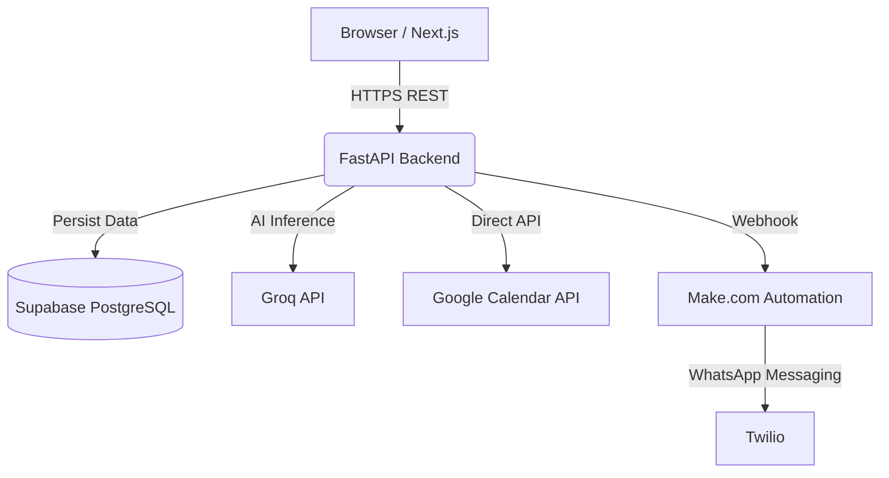

<div align="center">
  
  <h1>🎓 CampusFlow</h1>
  <p><strong>Autonomous Academic Copilot for B.Tech Students</strong></p>
  
  [](https://github.com/AdharshJolly/CampusFlow)
  [](https://nextjs.org/)
  [](https://fastapi.tiangolo.com/)
  [](https://supabase.com/)
  [](https://groq.com/)
  [](https://make.com/)
</div>

<br />

> **CampusFlow** is a smart student hub where AI processes college notices, automatically sends WhatsApp reminders, and syncs to Google Calendar so students never miss a deadline again. Built for the **CampusAI Hackathon 2025**.

---

## ✨ Features

- **🤖 AI Notice Processor:** Paste lengthy college syllabi, exam schedules, or professor emails. AI extracts precise events and flags risks automatically.
- **📅 Google Calendar Sync:** Every extracted deadline and assignment is instantly pushed to your Google Calendar.
- **📲 WhatsApp Reminders:** Never miss a due date. Automated 24h & 1h nudge messages sent directly to your phone.
- **⚡ Quick Capture Workspace:** Log tasks and homework with one click, automatically tagged with priorities and synced across platforms.

---

## 🏗️ System Architecture

CampusFlow uses a modern, serverless 3-tier architecture designed for speed and reliability.



### 🛠️ Tech Stack

| Layer | Technology | Hosting |
| :--- | :--- | :--- |
| **Frontend** | React, Next.js 15, TailwindCSS, Framer Motion | Vercel |
| **Backend** | Python 3.12, FastAPI, Pydantic | Railway / Render |
| **Database** | PostgreSQL, Supabase Auth (Custom JWT) | Supabase |
| **AI Engine** | Groq API (Kimi K2 / Llama 3) | Serverless |
| **Automation**| Make.com Webhooks, Twilio Sandbox | Cloud |

---

## 📂 Repository Structure

```text
CampusFlow/
├── frontend/          # Next.js 15 App (UI & State)
├── backend/           # FastAPI Application (API & AI Logic)
├── docs/              # Architecture, PRD, TDS, and Pitch Docs
├── prompts/           # System prompt templates for Groq
└── scripts/           # Utility and database migration scripts
```

---

## 🚀 Quick Start

To run CampusFlow locally, please see the complete setup guide in our Technical Design Specification:

👉 **[View Developer Setup Instructions (TDS.md)](docs/TDS.md)**

---

## 📚 Documentation Index

Whether you are a judge or a developer, everything you need is documented below:

| Document | Purpose |
| :--- | :--- |
| 📋 [**Product Requirements**](docs/PRD.md) | Problem statement, target audience, and scope |
| ⚙️ [**Technical Design**](docs/TDS.md) | Setup, tech stack details, and environment vars |
| 🏛️ [**Architecture**](docs/ARCHITECTURE.md) | High-level system architecture and data flow |
| 🔌 [**API Contract**](docs/API_SPEC.md) | Endpoints, payloads, and response models |
| 🗄️ [**Database Schema**](docs/DATABASE.md) | Table structures, columns, and relations |
| 🎨 [**Screen Specs**](docs/SCREEN_SPEC.md) | Frontend component breakdown |
| 🎤 [**Pitch Deck Outline**](docs/PITCH.md) | Complete script for the 2-minute demo pitch |

<br/>
<div align="center">
  <p><i>"The best student tools were built by students."</i></p>
  <p>Built with ❤️ for CampusAI Hackathon 2025</p>
</div>
