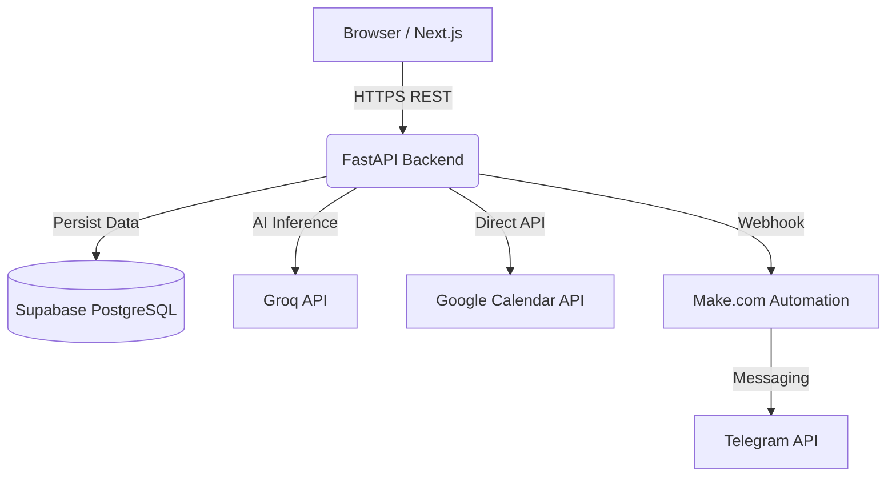

<div align="center">
  
  <h1>🎓 Academix</h1>
  <p><strong>Autonomous Academic Copilot for B.Tech Students</strong></p>
  
  [](https://github.com/AdharshJolly/Academix)
  [](https://nextjs.org/)
  [](https://fastapi.tiangolo.com/)
  [](https://supabase.com/)
  [](https://groq.com/)
  [](https://make.com/)
</div>

<br />

> **Academix** is a smart student hub where AI processes college notices, automatically sends Telegram reminders, and syncs to Google Calendar so students never miss a deadline again.

---

## ✨ Features

- **🤖 AI Notice Processor:** Paste lengthy college syllabi, exam schedules, or professor emails. AI extracts precise events and flags risks automatically.
- **📅 Google Calendar Sync:** Every extracted deadline and assignment is instantly pushed to your Google Calendar.
- **📲 Telegram Reminders:** Never miss a due date. Automated 24h & 1h nudge messages sent directly to your phone via our Telegram bot.
- **⚡ Quick Capture Workspace:** Log tasks and homework with one click, automatically tagged with priorities and synced across platforms.

---

## 🏗️ System Architecture

Academix uses a modern, serverless 3-tier architecture designed for speed and reliability.



### 🛠️ Tech Stack

| Layer | Technology | Hosting |
| :--- | :--- | :--- |
| **Frontend** | React, Next.js 15, TailwindCSS, Framer Motion | Vercel |
| **Backend** | Python 3.12, FastAPI, Pydantic | Railway / Render |
| **Database** | PostgreSQL, Supabase Auth (Custom JWT) | Supabase |
| **AI Engine** | Groq API (Kimi K2 / Llama 3) | Serverless |
| **Automation**| Make.com Webhooks, Telegram Bot API | Cloud |

---

## 📂 Repository Structure

```text
Academix/
├── frontend/          # Next.js 15 App (UI & State)
├── backend/           # FastAPI Application (API & AI Logic)
├── docs/              # Architecture, PRD, TDS, and Pitch Docs
├── prompts/           # System prompt templates for Groq
└── scripts/           # Utility and database migration scripts
```

---

## 🚀 Quick Start (Local Setup)

Academix is split into a Next.js 15 frontend and a FastAPI backend. Follow these steps to run the application locally.

### Prerequisites
- **Node.js** (v18+)
- **Python** (v3.11+)
- **Supabase Account** (for PostgreSQL & Auth)
- **Groq API Key** (for the AI Engine)


### 1. Backend Setup (FastAPI)
Open a new terminal and navigate to the backend directory:

```bash
cd backend
```

Create a virtual environment and activate it:
```bash
python -m venv venv
# On Windows: venv\Scripts\activate
# On Mac/Linux: source venv/bin/activate
```

Install the dependencies:
```bash
pip install -r requirements.txt
```

Set up your environment variables:
```bash
cp .env.example .env
```
Edit the `.env` file and fill in your Supabase URL, Supabase Service Role Key, and Groq API Key.

Run the FastAPI server:
```bash
uvicorn app.main:app --reload --port 8000
```
*The backend will be running at `http://localhost:8000`*

### 2. Frontend Setup (Next.js)
Open a separate terminal and navigate to the frontend directory:

```bash
cd frontend
```

Install the dependencies:
```bash
npm install
```

Set up your environment variables:
```bash
cp .env.example .env.local
```
Edit `.env.local` to include your Supabase credentials and point the backend API to `http://localhost:8000/api/v1`.

Run the development server:
```bash
npm run dev
```
*The frontend will be available at `http://localhost:3000`*


## 📚 Documentation Index

Whether you are a judge or a developer, everything you need is documented below:

| Document | Purpose |
| :--- | :--- |
| 📋 [**Product Requirements**](docs/PRD.md) | Problem statement, target audience, and scope |
| ⚙️ [**Technical Design**](docs/TDS.md) | Setup, tech stack details, and environment vars |
| 🏛️ [**Architecture**](docs/ARCHITECTURE.md) | High-level system architecture and data flow |
| 🔌 [**API Contract**](docs/API_SPEC.md) | Endpoints, payloads, and response models |
| 🗄️ [**Database Schema**](docs/DATABASE_SCHEMA.md) | Table structures, columns, and relations |
| 🎨 [**Screen Specs**](docs/SCREEN_SPEC.md) | Frontend component breakdown |

---

## 📜 License

This project is licensed under the MIT License - see the [LICENSE](LICENSE) file for details.

<br/>
<div align="center">
  <p><i>"The best student tools were built by students."</i></p>
  <p>Built with ❤️ by students, for students</p>
</div>
