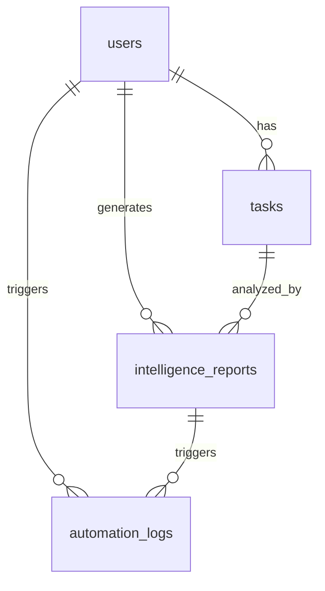

# Entity Relationship Diagram
## Academix Backend — Database Layer

See [docs/DATABASE.md](../docs/DATABASE.md) for the full schema reference.

This file is a quick-reference copy for backend developers.

