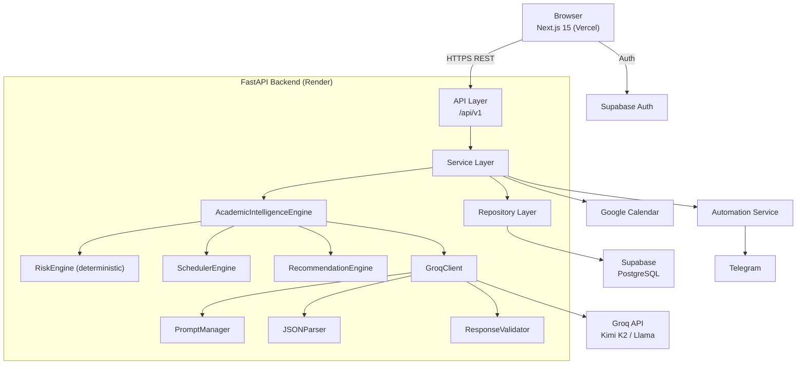
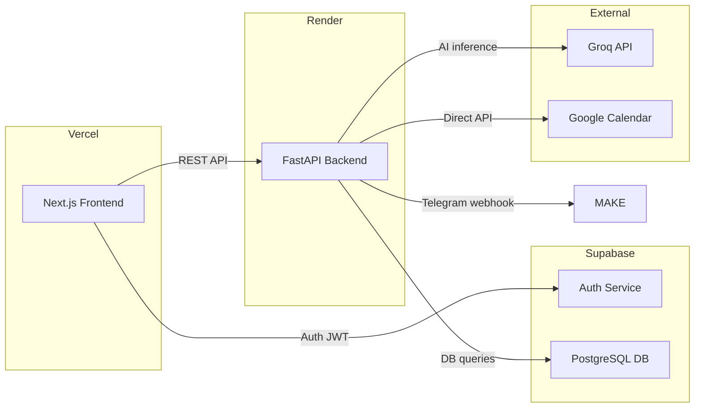
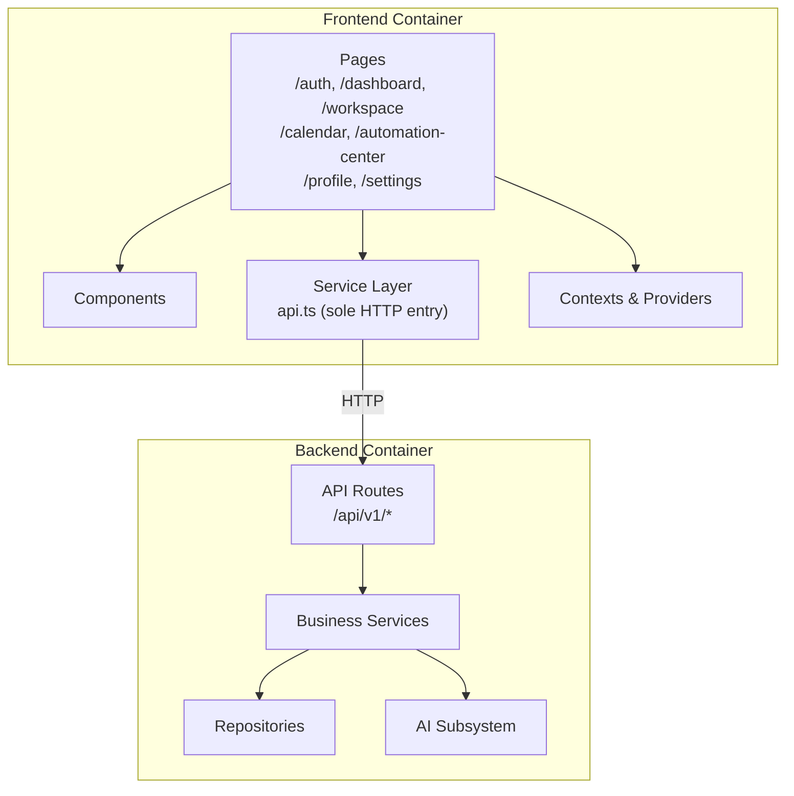
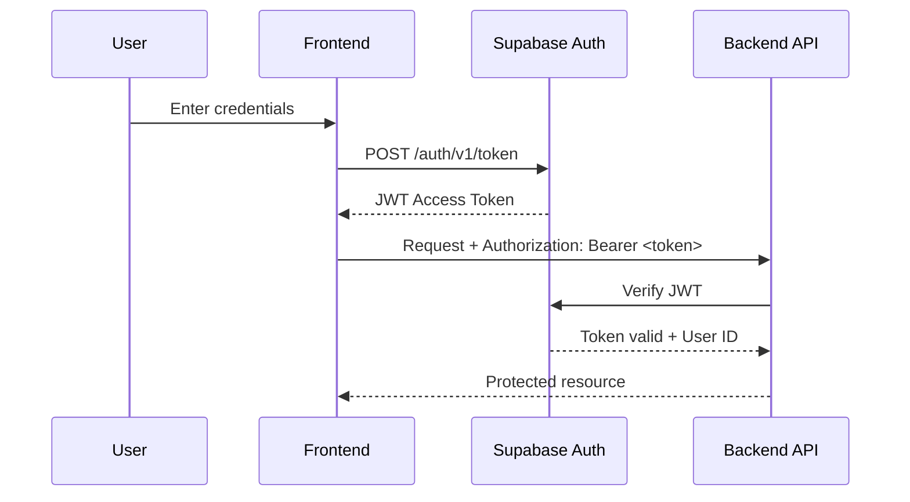
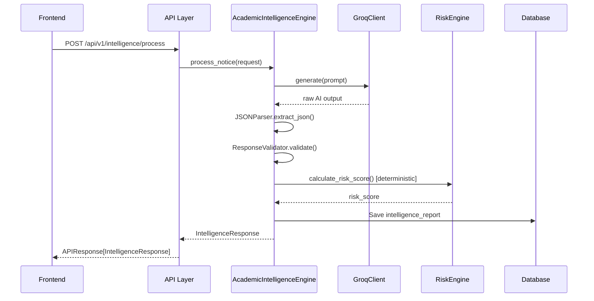
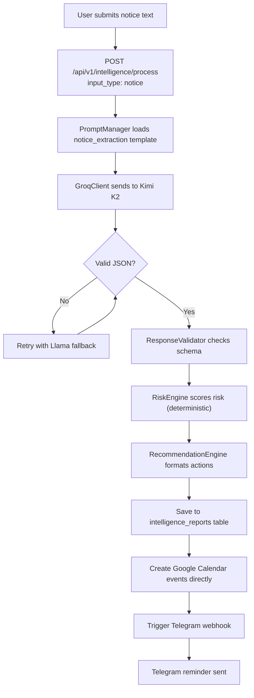
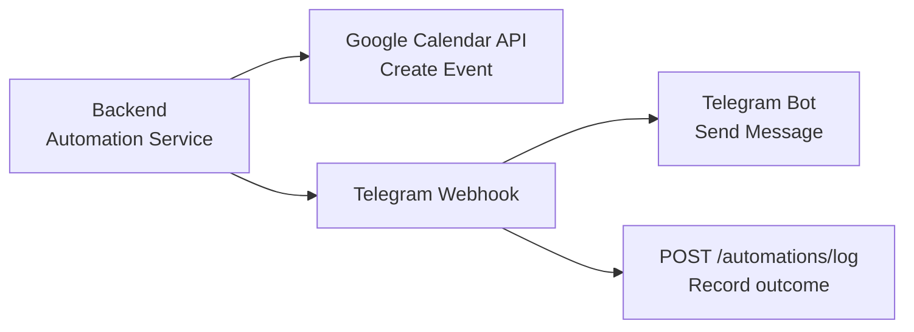
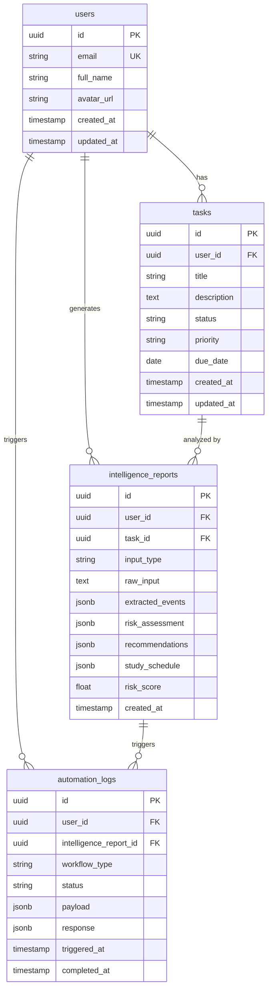
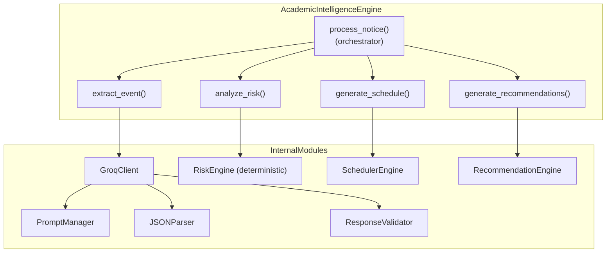

# Architecture Document
## Academix — Autonomous Academic Copilot
**Version:** 1.2 | **Status:** Frozen

---

## 1. System Architecture Diagram

---

## 2. Deployment Diagram

---

## 3. Container Diagram

---

## 4. Authentication Flow

---

## 5. AI Pipeline Sequence

---

## 6. Notice Processing Flow

---

## 7. Automation Flow

---

## 8. Database ER Diagram

---

## 9. Component Diagram — Academic Intelligence Engine

