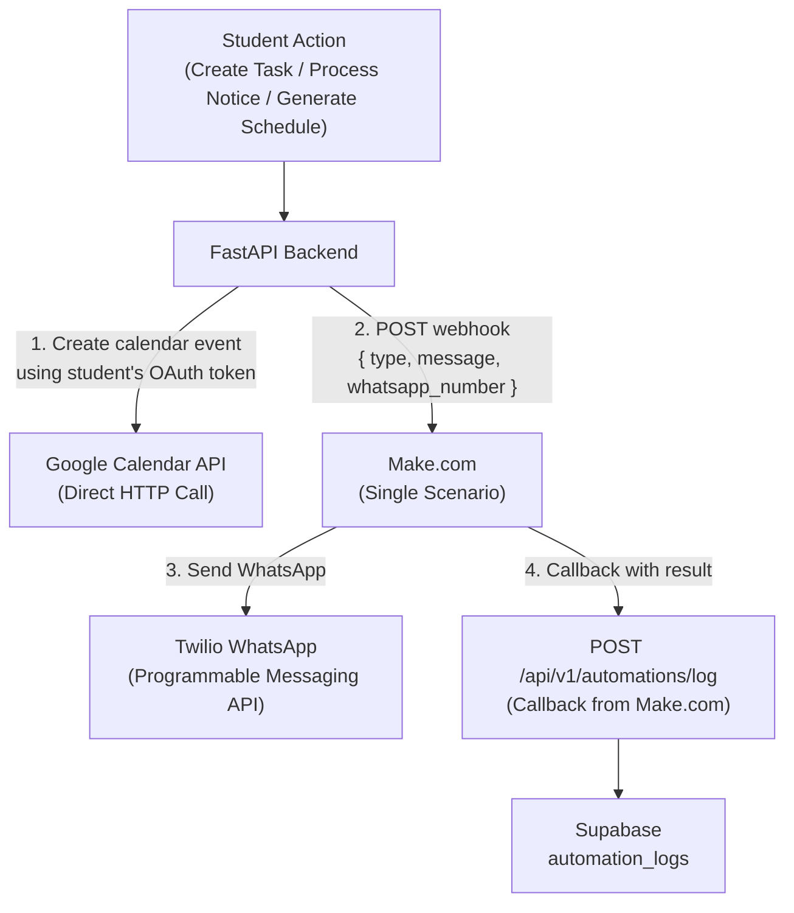
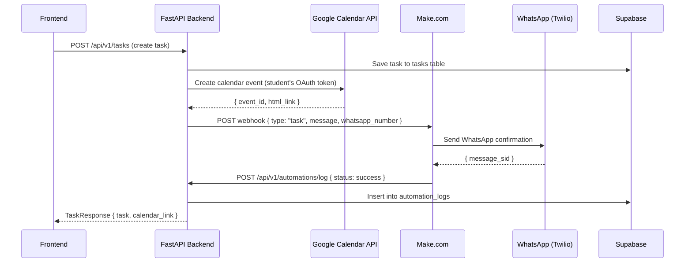
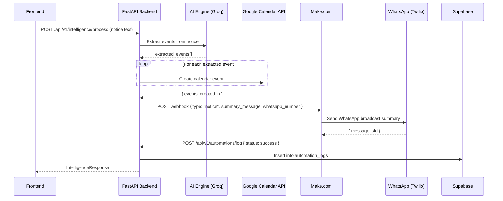
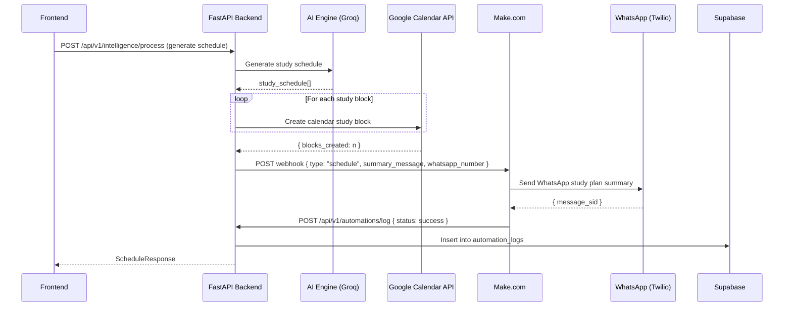

# AUTOMATION_PLAN.md

## CampusFlow — Revised Automation Architecture Plan

**Version:** 2.0
**Author:** Automation Engineer (Developer 4)
**Status:** Approved
**Updated:** 2026-06-25

---

## 1. Overview

This document describes the revised automation architecture for CampusFlow. After
evaluating the constraints of Make.com's free tier and the requirements for a
production-ready system, the team has agreed on a **split-responsibility model**:

| Responsibility | Owner | Tool |
|---|---|---|
| Google Calendar event creation | Backend (Developer 3) | Google Calendar API (direct) |
| WhatsApp notifications | Automation Engineer (Developer 4) | Make.com + Twilio |
| Automation logging | Backend (Developer 3) | Supabase `automation_logs` table |
| Callback after WhatsApp sent | Make.com → Backend | HTTP Request node |

---

## 2. Why We Changed the Architecture

### Original Plan (Rejected)
The original plan used **n8n / Make.com** to handle both Google Calendar and WhatsApp.

**Problems identified:**
- Make.com free tier does not support external OAuth2 credentials (Google Calendar)
- All calendar events would land on one shared team Google account — not scalable
- No per-user calendar access — violates user privacy in production
- Three separate Make.com scenarios needed — difficult to manage

### New Plan (Approved)
Split responsibilities cleanly between backend and Make.com.

**Benefits:**
- Backend handles Google Calendar directly per user using their OAuth2 token
- Make.com only handles WhatsApp — one simple scenario, three routes
- Production-ready from day one — each student's events go to their own calendar
- Fault isolation — if Make.com is down, calendar still works

---

## 3. Revised System Architecture



---

## 4. Detailed Flow by Trigger Type

### 4.1 Task Trigger



**WhatsApp Message:**
```
⏰ Task Added!
"{{title}}" is due on {{due_date}}.
Your Google Calendar has been updated! — CampusFlow 🎓
```

---

### 4.2 Notice Trigger



**WhatsApp Message:**
```
📣 Notice Alert!
{{n}} academic events have been extracted and added to your Google Calendar.
Check your calendar for deadlines! — CampusFlow
```

---

### 4.3 Schedule Trigger



**WhatsApp Message:**
```
📅 Study Plan Ready!
{{n}} study blocks added to your Google Calendar for this week.
Stay on track! — CampusFlow 🎓
```

---

## 5. Make.com Scenario Design

### Single Scenario Architecture

One Make.com scenario handles all three automation types using a **Router** node.

```
Webhook (Entry Point)
      |
   Router
  /   |   \
Task Notice Schedule
  \   |   /
  Twilio (Send WhatsApp)
      |
  HTTP Request (Callback to Backend)
```

### Webhook Payload Schema (Backend → Make.com)

The backend sends a **pre-built message string** — Make.com only needs to deliver it.

```json
{
  "type": "task | notice | schedule",
  "payload": {
    "whatsapp_number": "+91XXXXXXXXXX",
    "message": "Pre-built message string from backend"
  }
}
```

### Router Filter Conditions

| Route | Filter Condition |
|---|---|
| Route 1 | `type` equals `task` |
| Route 2 | `type` equals `notice` |
| Route 3 | `type` equals `schedule` |

Each route runs the same two nodes:
1. **Twilio → Send a Message** (uses `payload.whatsapp_number` and `payload.message`)
2. **HTTP Request → POST** to `/api/v1/automations/log`

### Make.com Environment

| Setting | Value |
|---|---|
| Scenario name | `CampusFlow Automation` |
| Webhook name | `campusflow-trigger` |
| Twilio From | `whatsapp:+14155238886` (Sandbox) |
| Scenario status | Active (ON) |

---

## 6. Backend — Google Calendar Integration

### Required Package
```bash
pip install google-api-python-client google-auth-httplib2 google-auth-oauthlib
```

### Environment Variables
```env
GOOGLE_CLIENT_ID=your_client_id
GOOGLE_CLIENT_SECRET=your_client_secret
GOOGLE_REDIRECT_URI=https://your-backend/api/v1/auth/google/callback
```

### Per-User OAuth2 Flow
```
Student registers → clicks "Connect Google Calendar"
     ↓
Backend redirects to Google OAuth2 consent screen
     ↓
Student grants calendar access
     ↓
Backend receives authorization code
     ↓
Backend exchanges code for access_token + refresh_token
     ↓
Backend stores refresh_token in Supabase users table
     ↓
All future calendar calls use this stored refresh_token
```

### Supabase Schema Update (Backend Lead)

Add these columns to the `users` table:

```sql
ALTER TABLE users ADD COLUMN google_refresh_token TEXT;
ALTER TABLE users ADD COLUMN google_calendar_connected BOOLEAN DEFAULT FALSE;
ALTER TABLE users ADD COLUMN whatsapp_number VARCHAR(20);
```

### Calendar Event Creation (Backend)

```python
from google.oauth2.credentials import Credentials
from googleapiclient.discovery import build

def create_calendar_event(refresh_token: str, event_data: dict):
    creds = Credentials(
        token=None,
        refresh_token=refresh_token,
        client_id=GOOGLE_CLIENT_ID,
        client_secret=GOOGLE_CLIENT_SECRET,
        token_uri="https://oauth2.googleapis.com/token"
    )
    service = build("calendar", "v3", credentials=creds)
    event = {
        "summary": event_data["title"],
        "description": f"Tracked by CampusFlow",
        "start": {"date": event_data["due_date"]},
        "end":   {"date": event_data["due_date"]},
    }
    result = service.events().insert(calendarId="primary", body=event).execute()
    return result.get("id"), result.get("htmlLink")
```

---

## 7. API Contract — Backend Endpoints

### 7.1 Automation Trigger (Internal — called by service layer)
Not exposed to frontend. Called internally after calendar creation.

```
POST {MAKE_WEBHOOK_URL}
Content-Type: application/json

{
  "type": "task | notice | schedule",
  "payload": {
    "whatsapp_number": "+91XXXXXXXXXX",
    "message": "string"
  }
}
```

### 7.2 Automation Log Callback (Make.com → Backend)
```
POST /api/v1/automations/log
Authorization: Bearer <internal_secret>
Content-Type: application/json

{
  "workflow_type": "task | notice | schedule",
  "status": "success | failed",
  "user_id": "uuid",
  "whatsapp_message_id": "twilio_sid",
  "error": "string (if failed)"
}
```

**Response:**
```json
{ "logged": true }
```

### 7.3 Automation Logs List (Frontend → Backend)
```
GET /api/v1/automations/logs?user_id={uuid}&limit=20
Authorization: Bearer <jwt>
```

**Response:**
```json
{
  "logs": [
    {
      "id": "uuid",
      "workflow_type": "task",
      "status": "success",
      "triggered_at": "2026-06-25T10:00:00Z",
      "completed_at": "2026-06-25T10:00:03Z"
    }
  ]
}
```

---

## 8. Environment Variables Summary

### Backend `.env`
```env
# Make.com
MAKE_WEBHOOK_URL=https://hook.eu2.make.com/xxxxxxxxxxxxxxxx

# Google Calendar OAuth2
GOOGLE_CLIENT_ID=xxxxxxxxxxxx.apps.googleusercontent.com
GOOGLE_CLIENT_SECRET=GOCSPX-xxxxxxxxxxxx
GOOGLE_REDIRECT_URI=https://your-backend/api/v1/auth/google/callback

# Automation Log Callback Secret
AUTOMATION_CALLBACK_SECRET=your_internal_secret
```

### Make.com Environment (configured in scenario)
```
Twilio Account SID   → from Twilio Console
Twilio Auth Token    → from Twilio Console
Twilio From Number   → whatsapp:+14155238886
Backend Callback URL → https://your-backend/api/v1/automations/log
```

---

## 9. Failure Handling

| Failure Point | Behaviour |
|---|---|
| Google Calendar API fails | Log error in `automation_logs`, return error to frontend, skip Make.com call |
| Make.com webhook unreachable | Backend retries once after 5 seconds, logs `whatsapp_status: failed` |
| Twilio WhatsApp fails | Make.com callback returns `status: failed`, backend logs it, calendar event remains |
| Student has no Google token | Skip calendar creation, log `calendar_status: not_connected`, proceed with WhatsApp |

---

## 10. Demo Checklist (Automation Engineer)

- [ ] Make.com scenario is **ON** and using Production webhook URL
- [ ] Twilio Sandbox — demo phone has joined (`join <keyword>` sent to `+14155238886`)
- [ ] Google Calendar OAuth2 connected for demo Google account
- [ ] Test task creation → WhatsApp arrives within 30 seconds ✅
- [ ] Test task creation → Google Calendar event appears ✅
- [ ] Make.com execution log shows green ✅
- [ ] Supabase `automation_logs` table has entry ✅
- [ ] Backend `.env` has `MAKE_WEBHOOK_URL` set to Production URL (not Test URL)

---

## 11. Comparison: Original vs Revised Plan

| Aspect | Original Plan | Revised Plan |
|---|---|---|
| Calendar tool | Make.com (OAuth2 blocked on free tier) | Backend (direct API call) |
| Calendar scope | Shared team calendar | Per-user personal calendar |
| WhatsApp tool | Make.com | Make.com (unchanged) |
| Make.com scenarios | 3 separate scenarios | 1 scenario with Router |
| Make.com ops used | Calendar + WhatsApp × 3 | WhatsApp × 3 only |
| Production-ready | ❌ No | ✅ Yes |
| Fault isolation | ❌ Single point of failure | ✅ Calendar independent of Make.com |
| Env variables | 3 webhook URLs | 1 webhook URL |

---

*This document supersedes the automation sections of `ARCHITECTURE.md` and `roadmap.md` for Developer 4's scope.*
