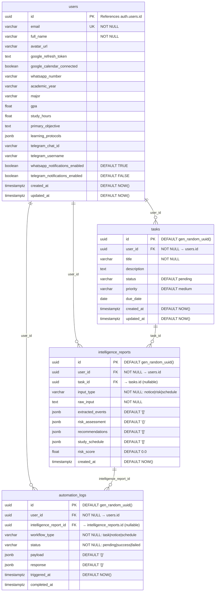

# Database Schema Reference
## Academix — Autonomous Academic Copilot
**Version:** 1.2 | **Status:** Frozen

---

## Tables

| Table                | Description                            |
|----------------------|----------------------------------------|
| users                | Student profiles (extends Supabase Auth) |
| tasks                | Academic tasks and deadlines           |
| intelligence_reports | AI analysis outputs                    |
| automation_logs      | Make.com workflow execution history         |

All AI output is stored in `intelligence_reports`.
No separate AI output tables exist.

---

## ER Diagram



---

## Constraints

### users
| Column     | Constraint       |
|------------|------------------|
| id         | PK, REFERENCES auth.users(id) ON DELETE CASCADE |
| email      | UNIQUE, NOT NULL |
| full_name  | NOT NULL         |
| created_at | DEFAULT NOW()    |
| updated_at | DEFAULT NOW()    |

### tasks
| Column     | Constraint                                        |
|------------|---------------------------------------------------|
| id         | PK, DEFAULT gen_random_uuid()                     |
| user_id    | FK → users.id, ON DELETE CASCADE, NOT NULL        |
| title      | NOT NULL, VARCHAR(255)                            |
| status     | CHECK (status IN ('pending','in_progress','completed','cancelled')) |
| priority   | CHECK (priority IN ('low','medium','high','urgent')) |

### intelligence_reports
| Column      | Constraint                                       |
|-------------|--------------------------------------------------|
| id          | PK, DEFAULT gen_random_uuid()                    |
| user_id     | FK → users.id, ON DELETE CASCADE, NOT NULL       |
| task_id     | FK → tasks.id, ON DELETE SET NULL (nullable)     |
| input_type  | CHECK (input_type IN ('notice','risk','schedule')) |
| raw_input   | NOT NULL                                         |
| risk_score  | CHECK (risk_score >= 0 AND risk_score <= 1)      |

### automation_logs
| Column      | Constraint                                       |
|-------------|--------------------------------------------------|
| id          | PK, DEFAULT gen_random_uuid()                    |
| user_id     | FK → users.id, ON DELETE CASCADE, NOT NULL       |
| workflow_type | CHECK (workflow_type IN ('task','notice','schedule')) |
| status      | CHECK (status IN ('pending','success','failed')) |

---

## Indexes

```sql
-- tasks
CREATE INDEX idx_tasks_user_id ON tasks(user_id);
CREATE INDEX idx_tasks_due_date ON tasks(due_date);
CREATE INDEX idx_tasks_status ON tasks(status);

-- intelligence_reports
CREATE INDEX idx_intelligence_user_id ON intelligence_reports(user_id);
CREATE INDEX idx_intelligence_created_at ON intelligence_reports(created_at);

-- automation_logs
CREATE INDEX idx_automation_user_id ON automation_logs(user_id);
CREATE INDEX idx_automation_status ON automation_logs(status);
CREATE INDEX idx_automation_triggered_at ON automation_logs(triggered_at);
```

---

## Notes
- Row Level Security (RLS) must be enabled on all tables via Supabase
- All `id` columns use UUID v4
- Timestamps use `timestamptz` (timezone-aware)

